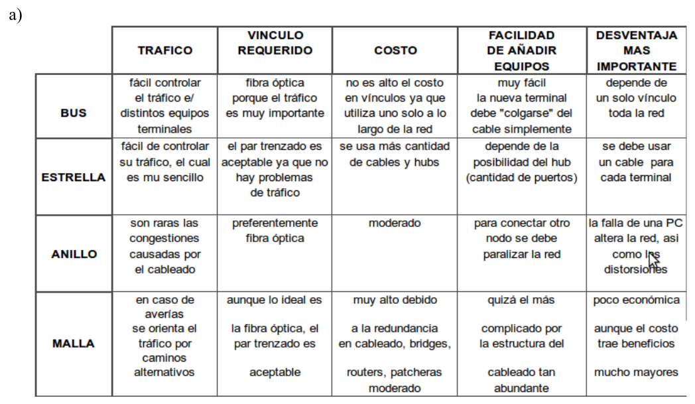
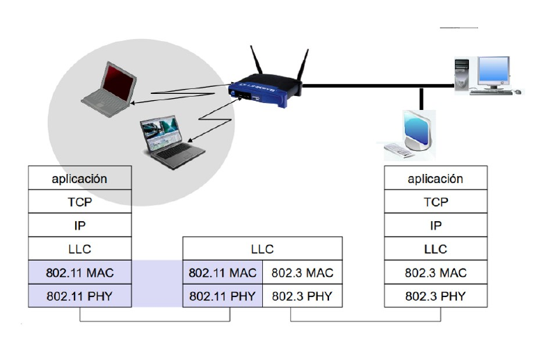
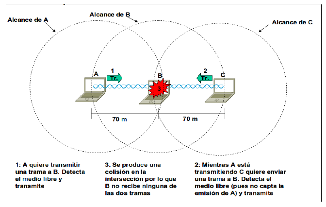
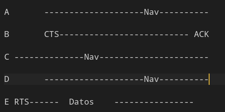
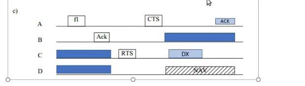
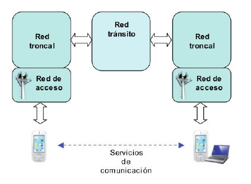
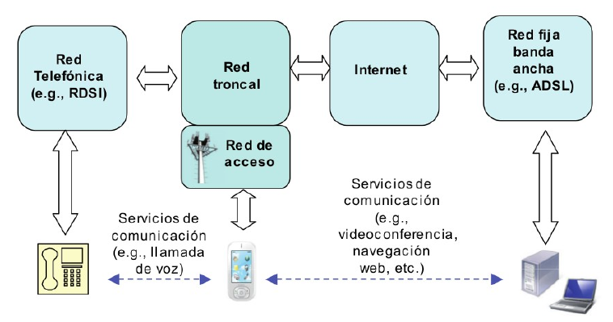

**Ejercicio 1**

a)

**Topología en Estrella.**

Esta topología se caracteriza por existir en ella un punto central, o más propiamente nodo
central, al cual se conectan todos los equipos, de un modo muy similar a los radios de una
rueda. De esta disposición se deduce el inconveniente de esta topología, y es que la máxima
vulnerabilidad se encuentra precisamente en el nodo central, ya que si este falla, toda la red
fallaría. Este posible fallo en el nodo central, aunque posible, es bastante improbable,
debido a la gran seguridad que suele poseer dicho nodo. Sin embargo presenta como
principal ventaja una gran modularidad, lo que permite aislar una estación defectuosa con
bastante sencillez y sin perjudicar al resto de la red.
Para aumentar el número de estaciones, o nodos, de la red en estrella no es necesario interrumpir, ni
siquiera parcialmente la actividad de la red, realizándose la operación casi inmediatamente.
La topología en estrella es empleada en redes Ethernet y ArcNet.

**Topología en Bus**

En la topología en bus, al contrario que en la topología de Estrella, no existe un nodo
central, si no que todos los nodos que componen la red quedan unidos entre sí linealmente,
uno a continuación del otro.
El cableado en bus presenta menos problemas logísticos, puesto que no se acumulan
montones de cables en torno al nodo central, como o curriría en un disposición en estrella.
Pero, por contra, tiene la desventaja de que un fallo en una parte del cableado detendría el
sistema, total o parcialmente, en función del lugar en que se produzca. Es además muy
difícil encontrar y diagnosticar las averías que se producen en esta topología.
Debido a que en el bus la información recorre todo el bus bidireccionalmente hasta hallar
su destino, la posibilidad de interceptar la información por usuarios no autorizados es
superior a la existente en una Red en estrella debido a la modularidad que ésta posee.
La red en bus posee un retardo en la propagación de la información mínimo, debido a que
los nodos de la red no deben amplificar la señal, siendo su función pasiva respecto al tráfico
de la red. Esta pasividad de los nodos es debida mas bien al método de acceso empleado
que a la propia disposición geográfica de los puestos de red. La Red en Bus necesita incluir
en ambos extremos del bus, unos dispositivos llamados terminadores, los cuales evitan los
posibles rebotes de la señal, introduciendo una impedancia característica (50 Ohm.)
Añadir nuevos puesto a una red en bus, supone detener al menos por tramos, la actividad de
la red. Sin embargo es un proceso rápido y sencillo.
Es la topología tradicionalmente usada en redes Ethernet.

**Topología en Anillo**

El anillo, como su propio nombre indica, consiste en conectar linealmente entre sí todos los
ordenadores, en un bucle cerrado. La información se transfiere en un solo sentido a través
del anillo, mediante un paquete especial de datos, llamado testigo, que se transmite de un
nodo a otro, hasta alcanzar el nodo destino.
El cableado de la red en anillo es el más complejo de los tres enumerados, debido por una
parte al mayor coste del cable, así como a la necesidad de emplear unos dispositivos
denominados Unidades de Acceso Multiestación (MAU) para implementar físicamente el
anillo.
A la hora de tratar con fallos y averías, la red en anillo presenta la ventaja de poder derivar
partes de la red mediante los MAU's, aislando dichas partes defectuosas del resto de la red
mientras se determina el problema. Un fallo, pues, en una parte del cableado de una red en
anillo, no debe detener toda la red. La adición de nuevas estaciones no supone una
complicación excesiva, puesto que una vez más los MAU's aíslan las partes a añadir hasta
que se hallan listas, no siendo necesario detener toda la red para añadir nuevas estaciones.
Dos buenos ejemplos de red en anillo serían Token-Ring y FDDI (fibra óptica)

b) 

* Bus: 1
* Estrella: n - 1
* Anillo: n
* Malla: n(n-1)/2

**Ejercicio 2**
* Malla: se pierde una de las conexiones pero como hay n-2 alternativas, no pasa nada.*
* Estrella: se pierde la conexión entre "el centro" y el dispositivo al que lo conectaba el enlace
* Bus: se generan dos subredes. Dispositivos de la misma subred se pueden seguir comunicando.
* Anillo: si se pierde unas de las conexiones, en el caso de que sea unidireccional un nodo podría recibir información pero no mandar. En el caso de que sea bidireccional la conexión no se pierde, solo se hace más larga/ineficiente.

Unidireccional: A -> B -> C -> A

Bidireccional: A <-> B <-> C <-> A

**Ejercicio 3**

Tenemos que la frecuencia máxima del medio es 20 KHz ==> B = 20 KHz
Por Nyquist, la señal filtrada se puede reconstruir por completo tomando 2B muestras por segundo (suponiendo 2 niveles).
Por lo tanto:
F_muestreo > 2 B = 2 * 20 KHZ = 40 KHz

**Ejercicio 4**

B es un RANGO de frecuencias
B = 4 MHz - 3 MHz = 1 MHz

SNR = 24 dB
SNR = 10 * log_10(S/N) = 24 dB <==> log_10(S/N) = 2.4 <==> 10 ^ 2.4 = S/N
==> S/N = 251.19

C = B * log_2(1 + S/N) = 1 * log_2(1 + 251) = 7.98 = 8 MBps

Dato de color a partir de esta C

Por Nyquist tenemos que:
C = 2Blog_2(V) = 2 * 1MHz * log_2(V) <=>
8/2 = log_2(V) <=>
2^4 = V <=>
16 = V = cantidad de niveles de la señal

**Ejercicio 5**
a) Switch. Dispositivo diseñado para resolver problemas de rendimiento de la red,
problemas de congestión y embotellamientos que opera en la capa 2.

b) Repetidor. Dispositivo que regenera la señal transmitida evitando su atenuación.

c) Hub. Dispositivo que permite centralizar el cableado de una red y poder ampliarla. Esto significa que recibe una señal y la repite por todos sus puertos.

d) Bridge.  Dispositivo que interconecta segmentos de una red. Funciona a través de una tabla de direcciones MAC detectadas en cada segmento al que está conectado. Sirve justamente para conectar redes con diferentes estándares.

**Ejercicio 6**
- la guita: capitalismo
- la distancia: diferentes medios tienen diferentes niveles de atenuación, entonces va a convenir elegir el mejor dentro de nuestro presupuesto
- la cant de nodos: otro parámetro de la escala, la calidad de los materiales va a depender de la cantidad de material a necesitar
- la cantidad de trafico esperada: redes con mucha demanda deberían ser de mejor calidad
- modularidad: ver que tan seguido se caería un enlace o se agregarían dispositivos para elegir la topología

**Ejercicio 7**

¿Entre C y D, cuál está más cerca de A?

C está más cerca de A, ya que su NAV arranca cuando A hace el RTS. En D, en cambio, el NAV arranca por el CTS de B. Por lo tanto, A está oculta a D (D no está al alcance de A).

**Ejercicio 8**

Capa de enlace
Funciones de la subcapa MAC (de acceso al medio):
  - recepción y transmisión: ensamblado de datos en trama y detección y o corrección de errores
  - administra el acceso al medio: de forma estática o dinámica
Funciones de la subcapa LLC (control de enlace lógico):
  - provee una interfaz de servicio hacia las capas superiores además de realizar control de flujo y errores

**Ejercicio 9**

No hay números, con lo cual no es el marcado por longitud de trama.
No hay bits, con lo cual no es el marcado de relleno ni el que hace uso de Manchester. 

Nos queda que sea el marcado Orientados a Caracteres. 

Por estándar, tenemos que:

Inicio de la trama = DLE STX

Fin de la trama = DLE ETX

Con lo cual nos queda analizar:
STX-DLE-DLE-ABC

STX no es ningún caracter especial con lo cual pertenece al mensaje.
DLE es el caracter de escape, y después sigue DLE, con lo cual lo agregamos al mensaje (ya que no es ni STX, ETX)
ABC pertenece al mensaje ya que no es nara raro.

Con lo cual nos queda el mensaje: STX-DLE-ABC

**Ejercicio 10**

a) Tiene una tasa de errores baja -->

Tipo 1 – Sin acuse y sin conexión: no espera confirmación de
recepción, no establece conexión, no hay corrección de errores. Es
apropiada cuando la tasa de errores es baja o para comunicaciones
en tiempo real.

b)  Tiene un medio de transmisión inestable -->
Tipo 3: - Con acuse y sin conexión: Se confirma la recepción de
cada trama enviada, y en caso de que esta no llegue puede
reenviarse. Es apropiada para canales inestables.

c) Necesita transmitir en tiempo real -->
Tipo 1 – Sin acuse y sin conexión: no espera confirmación de
recepción, no establece conexión, no hay corrección de errores. Es
apropiada cuando la tasa de errores es baja o para comunicaciones
en tiempo real

d) Se necesita transmitir datos multimedia, pero con control de errores -->
Tipo 2 – Con acuse y con conexión: Se establece una conexión
entre las máquinas antes de comenzar el envío. Se garantiza que
las tramas lleguen en orden y sin errores. Ideales para
comunicaciones punto a punto.

**Ejercicio 11**

NICETOHAVE: entender bien las tablas

**Ejercicio 12**

        |Fastbit ethernet| Gigabit ethernet | Canal de fibra | LAN Inalámbrica |
        |----------------|------------------|----------------|-----------------|
V       |    100 Mbps    |                  |                |                 |
Tx      |                |                  |                |                 |
E       |                |                  |                |                 |

Preguntar ://

**Ejercicio 13**
El problema de la estación oculta se da cuando 3 máquinas A, B y C se disponen de forma que: A y C están al alcance de B, pero A no está en el alcance de C y viceversa. Cuando A quiere transmitir a C, A detecta el medio libre y transmite. Mientras A transmite, C transmite porque también detecta el medio libre y se produce una colisión en B.

El problema se soluciona mediante un protocolo CSMA/CA con estilo MACA (que implementa tramas de control como RTS, CTS, ACK y NAV).

**Ejercicio 14**

a)
Se puede dar la siguiente situación: La estación E desea enviar a B por lo que escucha el canal. Cuando escucha una transmisión, concluye erróneamente que no debería transmitir a B, aunque A esté transmitiendo a la estación D. 

Los enlaces de radios son semi-dúplex, lo que significa que no pueden transmitir y escuchar al mismo tiempo en una sola frecuencia, con lo cual, no pueden detectar una colisión mientras están transmitiendo.
Por lo tanto 802.11 no utiliza CSMA/CD.

b)

      

**Ejercicio 15**

a)
A se comunica con B y C se comunica con D.
Con la ausencia de NAVs en estas comunicaciones, podemos ver que A y B no están al alcance de C y D.

b)
Alguien se trata de comunicar con A (está a su alcance), esta comunicación está fragmentada en 2 paquetes (por eso los dos ACK)

c)
* A transmitió f1 a B. B le confirma (ACK).
* C se quiere comunicar con A. D recién se entera de esto con el CTS de A. Por lo tanto, C no está al alcance de D.
* Del resto de las interacciones no tenemos certeza con la información provista.

Ejemplo donde todos están en la misma red:

**Ejercicio 16**

No, porque no puede tener 14 esclavos (el máximo es 7)

**Ejercicio 17**

- La versión 4 también tiene modo clásico o modo de alta velocidad.
- En la versión 4 un maestro puede estar conectado con más de 7 esclavos y cada nodo puede actuar como maestro o como esclavo al mismo tiempo.
- En la versión 4 la conexión es asíncrona (en la 3 es síncrona)

**Ejercicio 18**

- La versión smart se suele presentar como una versión más chica y más optimizada que la estandar aunque diferentes objetivos de diseño y desarrollo.
- En una piconet de un BT estandar, un maestro puede comunicarse con hasta 7 esclavos sobre los mismos canales físicos. Tanto maestro como esclavo son sincrónicos. 
En una piconet de un BLE,  un maestro puede comunicarse con más 7 esclavos sobre canales físicos separados. Tanto maestro como esclavo son asincrónicos.
- Un dispositivo BLE puede elegir entre las topologias broadcasting o de conexiones (se usa cuando se quiere transmitir bidireccionalmente y sigue un esquema maestro-esclavo).
- Ademas el mecanismo maestro-esclavo, tiene transmisor-receptor. 
  
TODO: leer apuntes cátedra porlas

**Ejercicio 19**

No puede ya que tanto maestro como esclavos son asincrónicos.

**Ejercicio 20**

Es por la naturaleza del sistema maestro-esclavo? (pag. 16 apunte redes inálambricas) CONSULTAR

**Ejercicio 21**

Los principales objetivos de LTE son:
- Incrementar las tasas de datos de los usuarios (downlink y uplink)
- Reducir retardos tanto en el establecimiento de la conexión como en la transmisión
- Ancho de banda escalable
- Mejorar la eficiencia espectral
- Arquitectura de red simplificada y con IP
- La interfase debe poder soportar diferentes tipos de usuarios
- Consumo de energía razonable para los terminales móviles
  
Velocidades en ambos enlaces: LTE incorpora eficiencias espectrales de pico de 5 bps/Hz y aumentables hasta 16 bps/Hz con esquemas MIMO 4x4.
(chequear esto último)

**Ejercicio 22**

**Ejercicio 23**

Sí, es la red acceso la que justamente provee el acceso a estos servicios.

Los componentes fundamentales del sistema LTE son la red de acceso E-UTRAN, el dominio de
paquetes EPC de la red troncal y la evolución del subsistema IMS. La red de acceso E-UTRAN y la
red troncal EPC proporcionan de forma conjunta servicios de transferencia de paquetes IP entre los
equipos de usuario y redes de paquetes externas tales como plataformas IMS y/o otras redes de
telecomunicaciones como Internet. Un punto a destacar es la contemplación del acceso a sus servicios
a través de UTRAN y GERAN así como mediante la utilización de otras redes de acceso que no
pertenecen a la familia 3GPP (CDMA2000, Mobile WiMAX, redes 802.11).

**Ejercicios 24**

Ventajas de OFDMA:
- Diversidad multiusuario: La asignación de subportadoras a usuarios se realiza en forma dinámica permitiendo cambiar en períodos cortos de tiempo dicha asignación a través de estrategias de scheduling.
- Diversidad frecuencial: Es posible asignar a un mismo usuario subportadoras no contiguas, suficientemente   separadas   como   para   que   el   estado   del   canal   en   las   mismas   sea independiente.
- Robustez frente a la propagación multicamino: Esta técnica logra ser muy robusta frente a la interferencia intersimbólica resultante de la propagación multicamino y además puede combatir la distorsión por medio de técnicas de ecualización en el dominio de la frecuencia.
- Flexibilidad en la banda asignada: Proporciona una forma sencilla de acomodar diferentes velocidades de transmisión a los diferentes usuarios en función de los requerimientos de servicio de cada uno.
- Elevada granularidad en los recursos asignables: Útil para acomodar servicios con diferentes requerimientos de calidad.

Desventajas de OFMDA:
- Elevada relación entre la potencia instantánea y la potencia media
- Susceptibilidad  frente a  errores  de frecuencia: Cuando existen desplazamientos  en la frecuencia   de   las   subportadoras   respecto   de   su   frecuencia   de   referencia   se   produce interferencia entre subportadoras. Por lo tanto, es necesario la disponibilidad de mecanismos de sincronización eficientes para corregir los errores en frecuencia

La técnica de acceso múltiple SC-FDMA (contiene una única portadora) utilizada en el enlace ascendente de LTE presenta las siguientes ventajas:
- Variaciones reducidas en la potencia instantánea de la señal transmitida.
- Posibilidad de llevar a cabo de forma sencilla mecanismos de ecualización en el dominio de la frecuencia
- Capacidad de proporcionar una asignación de banda flexible
  
Con comparación a OFDMA:

- Bajo PAPR (factor de cresta).
- Más robusto ante los valores nulos del espectro.
- Sensibilidad menor al offset de la frecuencia portadora.
- Complejidad menor del transmisor.