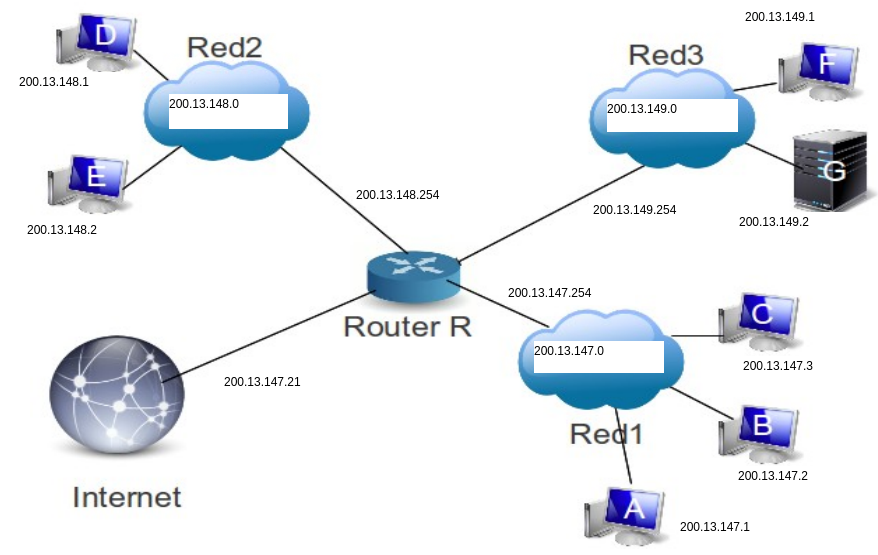
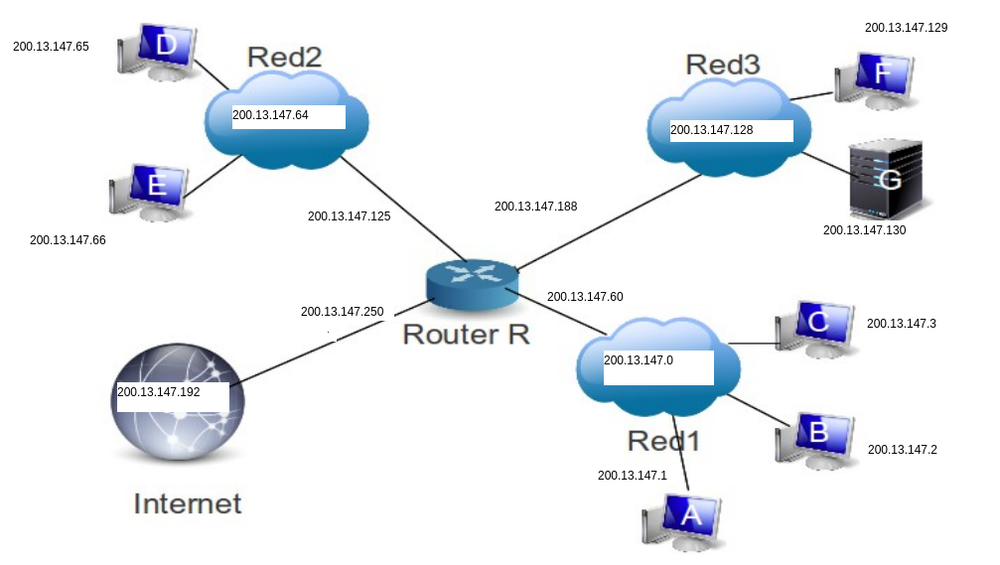
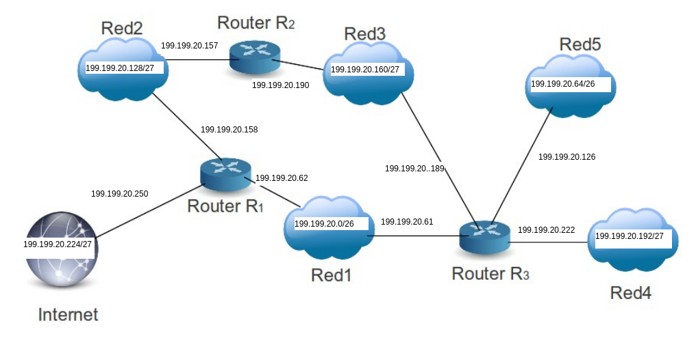
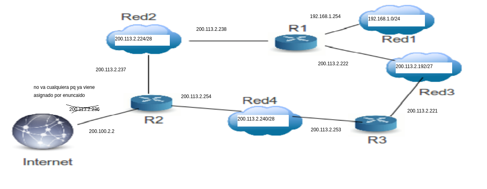

**Ejercicio 1**

i.

* Clase A Rango: 1 – 127 (La red 127 se reserva para loopback y pruebas internas) (/8)
* Clase B Rango: 128 – 191 (/16)
* Clase C Rango: 192 – 223 (/24)
* Clase D Rango: 224 – 239 (Reservadas para multicast) (/4)
* Clase E Rango: 240 – 255 (Reservadas para experimentación, usadas para investigación (/4)

ii.
* Clase A 255.0.0.0
* Clase B 255.255.0.0
* Clase C: 255.255.255.0
  
iii.
* Clase A Rango: 10.0.0.0 – 10.255.255.255
* Clase B Rango: 172.16.0.0 – 172.31.255.255
* Clase C Rango: 192.168.0.0 – 192.168.255.255

**Ejercicio 2**

* 220.200.23.1
  * Clase de red: C
  * Parte de red: 220.200.23
  * Parte del host: 1
  * Máscara: 255.255.255.0

* 148.17.9.1
  * Clase de red: B
  * Parte de red: 148.17
  * Parte del host: 9.1
  * Máscara: 255.255.0.0

*  33.15.4.13
   *  Clase de red: A
   *  Parte de red: 33
   *  Parte del host: 15.4.13
   *  Máscara: 255.0.0.0

* 249.240.80.78
  * Clase de red: E
  * Parte de red: -
  * Parte del host: -
  * Máscara: -

* 230.230.45.68
  * Clase de red: D
  * Parte de red: -
  * Parte del host: -
  * Máscara: -

* 192.68.12.8
  * Clase de red: C
  * Parte de red: 192.268.12
  * Parte del host: 8
  * Máscara: 255.255.255.0

* 177.100.18.4
  * Clase de red: B
  * Parte de red: 177.100
  * Parte del host: 18.4
  * Máscara: 255.255.0.0

* 95.250.91.99
Clase de red: A
Parte de red: 95
Parte del host: 250.91.99
Máscara: 255.0.0.0

**Ejercicio 3**

* Dirección IP de la red: 174.56.7.0
* 60 hosts
* 1020 subredes
* 2^10 = 1024
* 174.56.7.0 => mascara por defecto = /16 ==> mascara ideal = /26 (16+10) ==> 255.255.255.11000000
* Las direcciones son de 32 bits, con lo cual para los host nos queda:
* 32 - 26 = 6 ==> hay 2^6 = 64 hosts :D

**Ejercicio 4**
* Dirección IP de la red: 210.66.56.0
* 30 hosts
* 6 subredes
* 2^3 = 8
* 210.66.56.0 => mascara por defecto = /24 ==> mascara ideal = /27 (24+3)
* Las direcciones son de 32 bits, con lo cual para los host nos queda:
* 32 - 27 = 5 ==> hay 2^5 = 32 hosts :D

**Ejercicio 5**

i.
* La red es 193.52.57.0
* Nos piden 8 sucursales ==> nos piden 8 subredes.
* 2^3 = 8
* 193.52.57.0 ==> máscara por defecto = /24 ==> máscara ideal = /27 (24+3)
* No sabemos la cantidad de hosts así que no tenemos que chequear eso. Pero, para saber:
Cantidad de hosts útiles por subred = 2^5 - 2 = 30 (-2 pq 1 para el id de la red y el otro para el broadcast)

Nota: el ejemplo de Flavio optó por una máscara /28 (para tener 16 subredes, por si el día de mañana se abre otra sucursal)

ii.
Cantidad de hosts por subred = 30
* Subred 1 - 193.52.57.0  (000-00000) - rango de hosts: 193.52.57.1 a 193.52.57.30 -> .31 broadcast
* Subred 2 - 193.52.57.32 (001-00000) - rango de hosts: 193.52.57.33 a 193.52.57.62 -> .63 broadcast
* Subred 3 - 193.52.57.64 (010-00000) - rango de hosts: 193.52.57.65 a 193.52.57.94 -> .95 broadcast
* Subred 4 - 193.52.57.96 (011-00000) - rango de hosts: 193.52.57.97 a 193.52.57.126 -> .127 broadcast
* Subred 5 - 193.52.57.128 (100-00000)- rango de hosts: 193.52.57.129 a 193.52.57.158 -> .159 broadcast
* Subred 6 - 193.52.57.160 (101-00000)- rango de hosts: 193.52.57.161 a 193.52.57.190 -> .191 broadcast 
* Subred 7 - 193.52.57.192 (110-00000)- rango de hosts: 193.52.57.193 a 193.52.57.222 -> .223 broadcast
* Subred 8 - 193.52.57.224 (111-00000)- rango de hosts: 193.52.57.225 a 193.52.57.254 -> .255 broadcast

Nota: Flavio en las direcciones de cada subred agarra 8 random de esas 16 totales en su tabla

iii.
La dirección de broadcast de la 3er subred es 193.52.57.95

**Ejercicio 6**

i. El host 'A' envía un paquete IP a 'B'

El host A le manda el paquete al R1 y este sabe la ubicación de B (puede hacer una entrega directa) y se lo manda tanto a A como B. A lo ignora y B lo recibe (al ser Ethernet).

ii. El host 'A' envía un paquete IP a 'C'

El A manda el paquete al R1. Este no tiene entrega directa al destino, pero por su tabla de ruteo sabe que éste está bajo R4. Se lo envía a R4, y este lo envía tanto a C como a X. X lo ignora y C lo acepta.

**Ejercicio 7**

i.

a) Como ya tenemos 3 IP para cada una de las 3 redes, no es necesario subnetear.
Los enlaces entre router y la red en general toman el número de host más alto posible (pero es solo una convención como para no pifiarla asignando hosts y tener un margen)

Preguntar si el que va a internet es un host random que me haya quedado libre.

b)

Tabla de ruteo del R:

Destino | Máscara | Gateway|
--------|---------|--------|
200.13.147.0| /24 | Entrega directa|
200.13.148.0| /24 | ED|
200.13.149.0| /24 | ED|
0.0.0.0 | /0 | 200.13.147.21 (que vaya a internet) |

ii.

a)

El ID de la red es: 200.13.147.0

Necesitamos 3 subredes. Entonces con 2 bits nos alcanza ya que 2^2 = 4. Con lo cual la máscara nos queda /26 (24 de la default+2)

En cada subred tenemos 2^6 - 2 hosts UTILES = 62 (64 en total, pero el 1ero va al ID de la red y el último para broadcast)
* Subred 1: 200.13.147.0 (00-000000) => rango de hosts: 200.13.147.1 a 200.13.147.62 (.63 broadcast) 
* Subred 2: 200.13.147.64 (01-000000) => rango de hosts: 200.13.147.65 a 200.13.147.126 (.127 broadcast)
* Subred 3: 200.13.147.128 (10-000000) => rango de hosts: 200.13.147.129 a 200.13.147.190 (.191 broadcast)
* Subred 4: 200.13.147.192 (11-000000) => rango de hosts: 200.13.147.193 a 200.13.147.254 (.255 broadcast)
  
Nota: la subred4 no es necesaria para las redes pedidas, pero flavio la usó para el enlace al router que sale a internet pq sobraba digamos al tener que hacer 3 subredes y ya que estamos...

PD: En los enlaces entre los routers y las redes no usé el número máximo máximo pq pintó nomás 

b)

Tabla de routeo de R

Destino | Máscara | Gateway|
--------|---------|--------|
200.13.147.0| /26 | Entrega directa|
200.13.147.64| /26 | Entrega directa|
200.13.147.128| /26 | Entrega directa|
200.13.147.192 (internet) | /26 | Entrega directa |
0.0.0.0 | /0 | 200.13.147.1 (segun flavio) pero yo pondría 200.12.147.250|

El significado de la última línea sería: si quiero ir a cualquier otro lado que no sean las direcciones anteriores, lo mando al host A (PQ SI??!!?)

Y lo que yo quiero poner es que, si quiero ir a cualquier otra dirección de red que no sea las anteriores, lo mando a internet.

**Ejercicio 8**

* La 199.199.20.6 es la que va del router a Internet (pq las IP publicas son las que tienen acceso desde internet, asumiendo que la que nos dan es pública)

* La red 1 y la 5 tienen que tener como mínimo 50 hosts útiles c/u

* Las redes 2, 3 y 4 deben tener como mínimo 28 hosts útiles c/u
  
i. y ii.

ID de la red: 199.199.20.0/24 (al ser clase C). Asumo que la máscara es la por default de la clase, ya que si quisiera conservar esta IP: 199.199.20.00000110 y generar desde ahí, deberíamos usar una máscara de /31 y sería un absurdo poder cumplir los requerimientos del ejercicio.

Necesitamos 5 (6 si consideramos a internet) subredes. Como primera idea podríamos pensar en robarnos 3 bits del host, para así generar 8 subredes (ya que si nos robamos 2 bits generamos solo 4 subredes). Si hacemos esto, nos quedarían 5 bits para los hosts de cada subred. Es decir, tendríamos 2^5 - 2 = 30 hosts útiles por subred. Con lo cual, no podemos seguir adelante con esta idea ya que tenemos como requerimiento que las redes 1 y 5 tengan como mínimo 50 hosts útiles.

> Primer subneteo

Entonces, procedemos a realizar un primer subneteo generando solo 4 redes (robandonos 2 bit del host), para que éstas tengan mayor cantidad de hosts.
* Cantidad de subredes = 2^2 = 4
* Máscara resultante: /26 (24+2)
* Cantidad de hosts por subred = 2^6 = 64
* Cantidad de hosts útiles por subred = 62

Quedando:
* Subred1: 199.199.20.0/26
* Subred2: 199.199.20.64/26
* Subred3: 199.199.20.128/26
* Subred4: 199.199.20.192/26

Por los requerimientos de los hosts, procedemos a agrupar arbitrariamente de esta manera:
* Red 1: 199.199.20.0/26
* Red 5: 199.199.20.64/26
* Red 2 y 3: 199.199.20.128 <- debemos a su vez subdividirla
* Red 4 e Internet: 199.199.20.192 <- ¿debemos? a su vez subdividirla (¡)

*(¡) Nota post finalizado el ejercicio: si seguimos la idea de la resolución del 7)a), para el enlace a Internet le podemos mandar cualquier host que nos sobre, y nos ahorramos el subneteo de la subred4 y la usamos directamente para la Red 4, para así ahorrarnos un poco de trabajo*

Debemos ahora realizar un segundo subneteo para dividir éstas dos últimas subredes y poder asignarlas a cada una de las redes que queremos que la conformen.

> Segundo subneteo

Queremos 2 redes para cada una de estas ultimas subredes, con lo cual con robarnos un bit más de estas nos alcanza. 
* Cantidad de subredes en cada subred (las 2 últimas)= 2^1 = 2
* Máscara resultante: /27 (26+1)
* Cantidad de hosts por subred = 2^5 = 32
* Cantidad de hosts útiles por subred = 30

Con lo cual, finalmente nos quedan las siguientes direcciones:
* Red 1: 199.199.20.0/26 => rango hosts: 199.199.20.1 a 199.199.20.62 (.63 broadcast)
* Red 5: 199.199.20.64/26 => rango hosts: 199.199.20.65 a 199.199.20.126 (.127 broadcast)
* Red 2: 199.199.20.128/27 => rango hosts: 199.199.20.129 a 199.199.20.158 (.159 broadcast)
* Red 3: 199.199.20.160/27 => rango hosts: 199.199.20.161 a 199.199.20.190 (.191 broadcast)
* Red 4: 199.199.20.192/27 => rango hosts: 199.199.20.193 a 199.199.20.222 (.223 broadcast)
* Internet: 199.199.20.224/27

Posible esquema:

b) Tablas de ruteo

**R1**

Destino              |Máscara| Gateway  |
---------------------|------|-----------|
Red 1: 199.199.20.0  | /26  |Entrega directa           |
Red 2: 199.199.20.128| /27  |Entrega directa           |
Red 3: 199.199.20.160| /27  |199.199.20.61 (Red 1 a R3) (*) | 
Red 4: 199.199.20.192| /27  |199.199.20.61 (Red 1 a R3)           |
Red 5: 199.199.20.64 | /26  |199.199.20.61 (Red 1 a R3)           |
Inet: 199.199.20.224 | /27  |Entrega directa           |

(*) También podría haber sido 199.199.20.157 (Red 2 a R2). Es la entrada desde la red que sí tengo acceso desde R1, que tiene otra salida que va a mi red deseada (Red 3 en este caso)

**R2**

Destino              |Máscara| Gateway  |
---------------------|------|-----------|
Red 1: 199.199.20.0  | /26  |   199.199.20.158 (Red2 a R1)         |
Red 2: 199.199.20.128| /27  |Entrega directa           |
Red 3: 199.199.20.160| /27  |Entrega directa | 
Red 4: 199.199.20.192| /27  |199.199.20.189 (Red3 a R3)           |
Red 5: 199.199.20.64 | /26  |199.199.20.189 (Red3 a R3)            |
Inet: 199.199.20.224 | /27  |199.199.29.159 (Red2 a R1)    |

**R3**

Destino              |Máscara| Gateway  |
---------------------|------|-----------|
Red 1: 199.199.20.0  | /26  |Entrega directa            |
Red 2: 199.199.20.128| /27  |199.199.20.190 (Red3 a R2)           |
Red 3: 199.199.20.160| /27  |Entrega directa | 
Red 4: 199.199.20.192| /27  |Entrega directa           |
Red 5: 199.199.20.64 | /26  |Entrega directa           |
Inet: 199.199.20.224 | /27  |199.199.20.62 (Red1 a R1)     |

**Ejercicio 9**

* R2 se conecta a internet
* Red1 no tiene acceso a internet (pero sí las demás)
* ID de la red: 200.113.2.192/26 (ya viene subneteada)
* Necesitan: 
  * Red2: 11 hosts
  * Red3: 28 hosts
  * Red4: 12 hosts
  
i.

La Red 1 no tiene acceso a internet, con lo cual usamos una de las redes privadas de la clase. Como la IP es 200.x, estamos en la clase C, y en esta clase las redes privadas van desde 192.168.0.0 a 192.168.255.255. Con lo cual procedemos a darle a la Red 1 la IP 192.168.1.0/24

La red que más hosts demanda es la Red3. Por lo que si de los 6 bits que nos quedaron de host, tomamos 1 para subredes y 5 para host nos quedarían 2 subredes de 2^5 = 32 host c/u (30 hosts útiles)

> Primer subneteo

* Subred1: 200.113.2.192/27
* Subred2: 200.113.2.224/27

Dados los requerimientos de host, podemos agruparlas de esta manera:
* Red 3: 200.113.2.192/27
* Red 2 y 4: 200.113.2.224/27 <- debemos a su vez subdividirla para resolver este conflicto entre las redes 2 y 4

> Segundo subneteo

De los 5 bits que nos quedaron de host, necesitamos 4 para host ya que ambas redes necesitan más de 8 hosts (11/12 resp.). Con lo cual de esos 5 bits, tomamos 1 para subredes y podemos hacer 2 nuevas subredes con 2^4=16 hosts c/u (14 hosts útiles)

* Subred1': 200.113.2.224/28 = Red 2
* Subred2': 200.113.2.240/28 = Red 4

Finalmente nos queda:

* Red1: 192.168.1.0/24 => rango hosts: 192.168.1.1 a 192.168.1.254 (.255 broadcast)
* Red2: 200.113.2.224/28 => rango hosts: 200.113.2.225 a 200.113.2.238 (.239 broadcast)
* Red3: 200.113.2.192/27 => rango hosts: 200.113.2.193 a 200.113.2.222 (.223 broadcast)
* Red4: 200.113.2.240/28 => rango hosts: 200.113.2.241 a 200.113.2.254 (.255 broadcast)

Posible esquema:

ERRATA: lo que está tachado no tiene que estar tachado pq una cosa es la IP del globo (internet) y otra el enlace.

ii.

Tablas de routeo

**R2**

Destino              |Máscara| Gateway  |
---------------------|------|-----------|
Red 1: 192.168.1.0  | /24  |200.113.2.238 (Red2 a R1)            |
Red 2: 200.113.2.224| /28  |Entrega directa          |
Red 3: 200.113.2.192/27| /27  |200.113.2.254 (Red4 a R3) | 
Red 4: 200.113.2.240| /28  |Entrega directa         |
0.0.0.0 | /0  |  200.100.2.2 (va para internet)          |

**R3**

Destino              |Máscara| Gateway  |
---------------------|------|-----------|
Red 1: 192.168.1.0  | /24  |200.113.2.222 (Red3 a R1)            |
Red 2: 200.113.2.224| /28  |200.113.2.254 (Red4 a R2)          |
Red 3: 200.113.2.192/27| /27  |Entrega directa | 
Red 4: 200.113.2.240| /28  |Entrega directa          |
0.0.0.0 | /0  |200.113.2.254 (Red4 a R2) (y ahí el R2 sabe que hacer y lo manda para internet)           |

