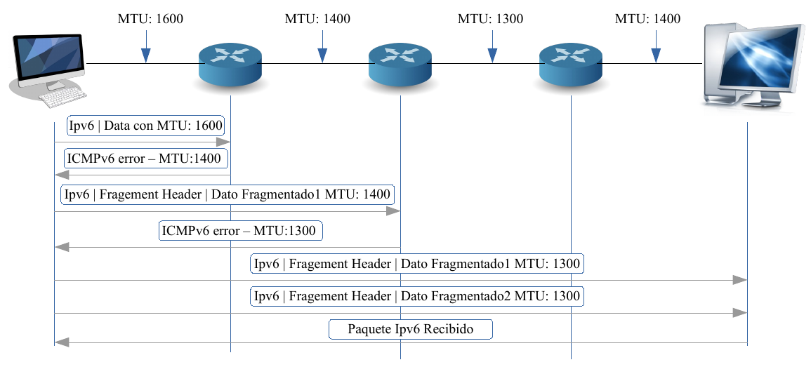
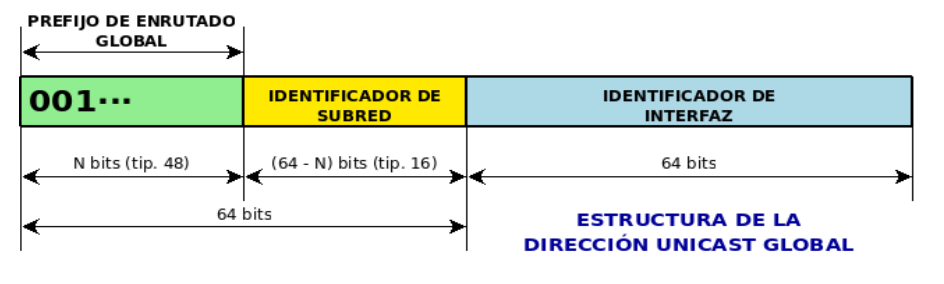
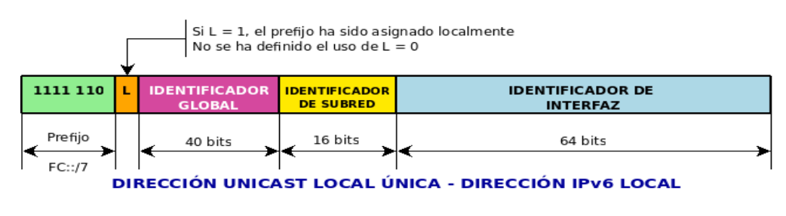
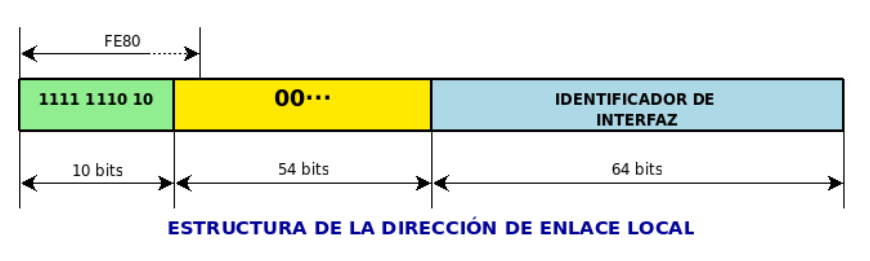

**Ejercicio 1**

Las cabeceras NO SON COMPATIBLES, aquí algunas diferencias:

* En ipv4 las direcciones tienen 32 bits, en ipv6 tienen 128 bits. 
* En ipv4 hay un campo que indica fragmentación y en ipv6 se remueve de la cabecera básica (ya que la fragmentación no se realiza en todos los nodos sino solamente en el primero)
* Se retiró el campo de checksum (entre otros) de la cabecera ipv6
*  El tipo de servicio se modifica a traffic class
*  El TTL ahora se traduce a Hop limit (cantidad máxima de saltos que puede dar un datagrama)
*  Con todos estos cambios se puede ver que la cabecera IPv4 ocupa 20 bytes y que la cabecera IPv6 ocupa 40 bytes.

**Ejercicio 2**

Las cabeceras de extensión se pueden agregar a continuación de la cabecera base de IPv6. Se identifican por el campo next header y tienen un orden en particular para que el procesamiento sea más eficiente. Disminuye el procesamiento de elementos de red intermedios, i.e., se procesa la información sólo por los nodos destino (excepción: Hop-by-Hop Options Header).
Se implementan fuera de la cabecera base porque añaden funcionalidades extra, es decir, se añaden de forma opcional (en ipv4 eran campos requeridos). Esto hace sea más fácil para los routers ignorar funcionalidad que no está destinada para ellos. 

**Ejercicio 3**

a)
(MTU = maximum transfer unit)
La técnica Path MTU Discovery incluye dos etapas: en la primera el origen envı́a mensajes para averiguar el MTU de cada enlace (mientras actualiza el mı́nimo MTU encontrado a través de los mensajes ICMPv6 que recibe de respuesta) hasta llegar hasta el destino; en la segunda etapa el emisor manda el mensaje fragmentado (el tamaño máximo de paquete será el mı́nimo MTU encontrado).

Para el esquema del enunciado el proceso sería algo así:

b)
En IPv4 la fragmentación se podia realizar en todos los nodos intermedios potencialmente. En IPv6 la fragmentación se realiza solamente en el origen (y luego se reensambla en el destino) si todos los nodos intermedios soportan la técnica Path MTUD.

**Ejercicio 4**

a) FF01::1
b) 2001:0:123 4::C1C0:ABCD:876

**Ejercicio 5**

El hostID queda siempre igual, de 64 bits. Se achica en el netID. Acá la máscara se le suele llamar prefijo también.

* *Unicast Global*: Globalmente ruteables, análogas a las direcciones públicas IPv4.  Se suelen usar las máscaras /48 (2^16 redes), /56 (2^8 redes) y /64 (2^0 = 1 red).
Arrancan con 001 (es decir que si una dir. no arranca con F, es pública)

* *Unicast unique-local*: análogas a IPv4 privadas (se usan cuando una red no tiene conexión a internet o cuando se dispone de un router NAT). Son routeables a nivel local pero no global. No es necesario registrarlas. Ruteos internos dentro de un enlace o conjunto de enlaces.
Puede interconectar dos redes sin conflictos; puede haber comunicación sin Internet.
Arrancan con FC o FD, elige uno el id global

* *Unicast Link-Local*:  tienen la forma FE80::/10, son válidas dentro de un mismo enlace y NO son routeables. Se generan automáticamente. Se usan para neighbour discovery, entre otras cosas.
Los paquetes no salen fuera del router, este los manda de nuevo para adentro.
These addresses refer only to a particular physical link and are used for addressing on a single link for purposes such as automatic address configuration and neighbor discovery protocol. Link-local addresses can be used to reach the neighboring nodes attached to the same link. The nodes do not need a globally unique address to communicate. Routers will not forward datagram using link-local addresses. IPv6 routers must not forward packets that have link-local source or destination addresses to other links. All IPv6 enabled interfaces have a link-local unicast address.

**Ejercicio 6**

a) 2001:db8:0:8::/61
64-61 = 3 => tenemos 2^3=8 subredes.
2001:db8:0:8:: -> 2001:db8:0:8:FFFF:FFFF:FFFF:FFFF
2001:db8:0:9:: -> 2001:db8:0:8:FFFF:FFFF:FFFF:FFFF
...
2001:db8:0:F:: -> 2001:db8:0:F:FFFF:FFFF:FFFF:FFFF

b) 2001:0:0:ad00::/56
64-56 = 8 => tenemos 2^8 = 256 subredes
2001:0:0:ad00:: -> 2001:0:0:ad00:FFFF:FFFF:FFFF:FFFF
2001:0:0:ad01:: -> 2001:0:0:ad01:FFFF:FFFF:FFFF:FFFF
...
2001:0:0:adFF:: -> 2001:0:0:adFF:FFFF:FFFF:FFFF:FFFF

**Ejercicio 7**

- Red1: 192.0.2.0/24

Agrego :ffff: adelante:
:ffff:192.0.2.0

Calculamos la direccion ipv4:
(192 * 256 * 256 * 256) + (0 * 256*256) + (2 * 256) + 0 = 3221225984 (decimal)

A este numero le sumamos FFFF:
281470681743360 + 3221225984 = 281.473.902.969.344 (decimal)

Si convertimos este numerote a hexa, nos queda:
FFFF:C000:0200

Con lo cual la dirección final nos queda:
0:0:0:0:0:FFFF:C000:0200

- Red2: 203.0.113.0/24
  
:ffff:203.0.113.0

Convertimos 203.0.113.0 a decimal:
(203 * 256 * 256 * 256) + 0  + 113 * 256 + 0 = 3405803776

Le sumamos FFFF en decimal:
281470681743360 + 3405803776 = 2.814740875x10^14 xd

Si convertimos este numerote a hexa y le agremos los 0 adelante nos queda:

0:0:0:0:0:FFFF:CB00:7100

- Red3: 198.51.100.0/24 --> 0:0:0:0:0:FFFF:C633:6400

**Ejercicio 8**
customer tiene 2 grupos: 1 para la elite y otro para los usuarios finales/comunes.
le digo al router que los 0410 vayan por arriba pq es más confiable (estrella) y los 0418 (usuarios comunes) vayan por abajo (bus o anillo)
donde se unen las 2 nubes debería haber un router, que ese los vuelve a direccionar a ese servidor o nube central ponele de la derecha
con una mascara de /32 separo, y con una de /16 unifico

**Ejercicio 9**

a) Asigne direcciones IPv6 *visibles desde Internet* a todos los elementos de red

Tienen que ser unicast global, necesitamos 3 subredes.

* Red1: 2001:db8: 1234:0001::/60
  * Ej. Dir global del dispositivo A: (con la dir. calculada en el apartado b)
    * 2001:db8: 1234:0001:0200:0Cff:fe00:0707
* Red2: 2001:db8: 1234:0002::/60
* Red3: 2001:db8: 1234:0003::/60

Como no especifica dirección base, me saco de la galera una global cualquiera. Con /62 ya se llega al nro requerido de subredes. Pero se aconseja poner multiplos de 4 para no dejar nibbles en el medio (y agarrar un nro entero hexa). Así quedaría /60

b) Asigne direcciones IPv6 a A, B, C *no ruteables* a través de R1

Estas direcciones deben ser unicast link-local. Estas deberán ser inferidas de la dirección MAC de cada dispositivo.

- Dispositivo A, MAC: 00:00:0C:00:07:07
1. Agregamos ff:fe en el medio: 00:00:0C:ff:fe:00:07:07
2. Reformateamos a la notación de IPv6: 0000:0Cff:fe00:0707
3. Convertimos el primer octeto de hexadecimal a binario: 00 -> 00000000
4. Invertimos el bit en la posicion 6 (indexando desde 0): 00000010
5. Convertimos el octeto de nuevo a hexadecimal: 00000010 -> 02
6. Reemplazamos el primer octeto con el nuevo que calculamos recién: 0000:0Cff:fe00:0707 -> 0200:0Cff:fe00:0707
7. Anteponemos el prefijo link-local: **fe80::0200:0Cff:fe00:0707**

- Dispositivo B, MAC: 00:00:0C:00:07:13
La MAC es casi idéntica a la de A, con lo cual nos va a quedar:
**fe80::0200:0Cff:fe00:0713**

- Dispositivo C, MAC: 00:00:C6:12:12:01
00:00:C6:ff:fe:12:12:01
0000:C6ff:fe12:1201
00 -> 00000000
00000000 -> 00000010
00000010 -> 02
0000:C6ff:fe12:1201 -> 0200:C6ff:fe12:1201
0200:C6ff:fe12:1201 -> **fe80::0002:C6ff:fe12:1201**

c) Asigne direcciones IPv6 visibles dentro de la estructura de red pero no desde Internet.

Las direcciones deben ser unicast unique-local

* Red1: FC00:db8: 1234:0001::/60
  * Ej: Dir. privada del dispositivo A: 
    * FC00:db8: 1234:0001:0200:0Cff:fe00:0707
* Red2: FC00:db8: 1234:0002::/60
* Red3: FC00:db8: 1234:0003::/60
